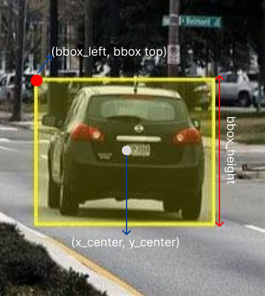

# VisDrone to YOLO

## VisDrone Format 

```<bbox_left> , <bbox_top> , <bbox_width> , <bbox_height> , < score > , <object_category> , < truncation > , < occlusion >```
 
| Value  | Explanation |
| ------------- | ------------- |
| bbox_left  | Sınırlayıcı kutunun sol-üst koordinatının x değeri |
| bbox_top  | Sınırlayıcı kutunun sol-üst köşesinin y değeri  |
| bbox_width  | Sınırlayıcı kutunun genişliği  |
| bbox_height  | Sınırlayıcı kutunun yüksekliği  |
| score | _ |
| object_category | Nesnenin sınıf indeksi | 
| truncation | _ |
| occlusion | _ |
  
**VisDrone sınıfları:** 
  1. ignored regions 
  2. pedestrian 
  3. people 
  4. bicycle 
  5. car
  6. van 
  7. truck  
  8. tricycle  
  9. awning-tricycle 
  10. bus 
  11. motor 
  12. others 
 
## YOLO Format 
```<object-class> <x_center> <y_center> <width> <height>```
| Value  | Explanation |
| ------------- | ------------- |
| object-class  | Nesnenin sınıf indeksi |
| x_center  | Sınırlayıcı kutunun merkez x koordinatı |
| y_center  | Sınırlayıcı kutunun merkez y koordinatı |
| width  | Sınırlayıcı kutunun genişliği  |
| height | Sınırlayıcı kutunun yüksekliği |

Görüntünün genişlik ve yüksekliğine göre oranlandığı için ```x_center, y_center, width, height``` değerleri (0.0, 1.0] arasındadır.

```x_center = x / image_width``` , ```height = height / image_height```

VisDrone ile YOLO arasındaki fark görsel olarak aşağıdaki şekilde gösterilmiştir. Gri nokta YOLO'nun aldığı koordinatı, kırmızı nokta ise VisDrone koordinatını belirtmektedir.



## Kullanım

VisDrone resimlerinizi [VisDrone-Images](https://github.com/ErenKaymakci/visdrone2YOLO/tree/main/VisDrone-Images), VisDrone etiketlerinizi [VisDrone-Labels](https://github.com/ErenKaymakci/visdrone2YOLO/tree/main/VisDrone-Labels) klasörlerine koyun. 

``` 
python visdrone2yolo.py 
```

eğer "ignored regions" ve "other" sınıflarının etikete yazılmasını istemiyorsanız:

```
python visdrone2yolo.py --ignore 1
``` 

## Lisans
[MIT](https://github.com/ErenKaymakci/visdrone2YOLO/blob/main/LICENSE)

